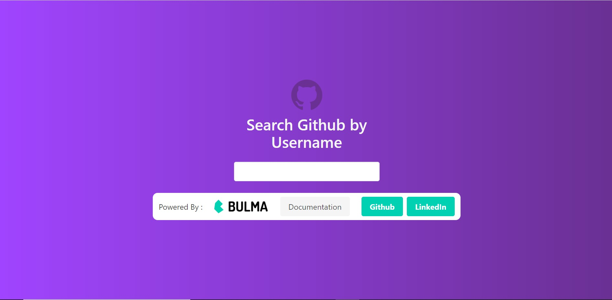

# Github Portfolio Visualizer Using Svelte and Bulma CSS 

## Svelte
Svelte is a radical new approach to building user interfaces. Whereas traditional frameworks like React and Vue do the bulk of their work in the browser, Svelte shifts that work into a compile step that happens when you build your app. Instead of using techniques like virtual DOM diffing, Svelte writes code that surgically updates the DOM when the state of your app changes. Read more information about Svelte at it's [official website](https://svelte.dev/) .

## Bulma
Bulma: the modern CSS framework that just works.
Bulma is a free, open source framework that provides ready-to-use frontend components that you can easily combine to build responsive web interfaces. It makes CSS code much much easier to write . You can read more about Bulma at it's [official website](https://bulma.io/) .

### Issues with Svelte
On compiling and building a svelte application for deployment , a separate folder called `build` is created containing the necessary bundle files. Due to some technical issues the built project oftens faces problems due to caching by the browser , which can cause the website to behave in an unpredictable manner . You can know more about this issue [here](https://github.com/sveltejs/template/issues/77) . Hence in order to avoid such irratic behaviour , I have hard coded the site to directly open stats for my website only . You can easily bypass this and try to see the stats for some other github repository but then it cannot be guaranteed that the caching issue dosent occur . I will update the codebase of this repository as soon as the issue is fixed but till then the codoebase shall remain hardcoded to fetch stats only from my github account a.k.a [Ansh-Sarkar](https://github.com/Ansh-Sarkar) .

